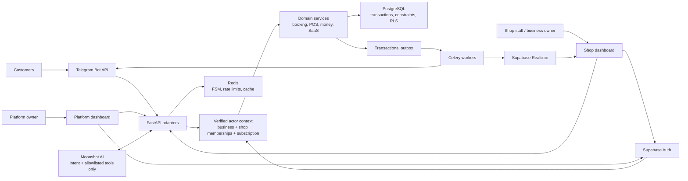

# Architecture

> Target architecture with implementation status through Phase 2 T2.3. Read [../START_HERE.md](../START_HERE.md) before assuming a later component exists.

This is the one-screen system view. [MASTER_PLAN.md](MASTER_PLAN.md) defines behavior and [DATA_MODEL.md](DATA_MODEL.md) defines persistence and authorization.



## Trust and authorization path

```text
Web request:
Supabase JWT → signature/audience/expiry verification → auth user
→ database memberships → selected business/shop authorization
→ subscription-state gate → domain operation

Telegram update:
opaque bot route → secret header + update dedupe → bot registry
→ shop + Telegram identity → active membership/customer
→ subscription-state gate → domain operation
```

No endpoint accepts tenant scope merely because the client supplied an ID. `app_metadata` may mark platform-admin eligibility, but normal owner/staff scope is derived from database memberships so one owner can span several shops without issuing a new JWT.

## Durable transaction boundary

All important mutations use one async PostgreSQL transaction:

```text
validate authorization/subscription
→ lock relevant rows
→ enforce idempotency key
→ write domain records
→ write ledger/audit/outbox
→ commit
```

Outbox workers send Telegram/Realtime notifications only after commit. Redis outages may reduce rate limiting, FSM convenience, or delivery speed, but cannot lose a booking, create a second receipt, change a balance, or allocate a duplicate queue number.

## Data boundaries

- `business_id` is the commercial tenant boundary.
- `shop_id` is the operational boundary.
- Tenant child rows carry both where needed, with composite foreign keys preventing a child from referencing a parent in another shop/business.
- RLS denies all by default and uses membership helper functions.
- Platform access is a separate audited path.
- The public queue is an opaque-token API projection with no table access and no PII.
- T2.1 operation sources—services, customers, calendars, legal/VAT profiles, and commission rules—are implemented with forced RLS and composite tenant foreign keys.
- T2.2 booking mutations are implemented through FastAPI. PostgreSQL owns five-minute holds, appointment overlap, queue counters, deterministic barber allocation, state/idempotency/audit/outbox, and reschedule history. Celery Beat rescans PostgreSQL each minute for hold expiry and T-30 promotion. Redis remains only the Celery broker/rate-limit/cache layer and cannot change a durable booking or queue result.
- T2.3 legal/cash operations are implemented through FastAPI. PostgreSQL owns effective legal-document selection, fiscal-year sale/credit-note counters, one open shift per shop/register, append-only cash effects, and exact close reconciliation. Card is structurally absent from physical-cash movements; checkout connects to the existing `cash_sale` source type in T2.4.
- POS, cash, journal, advance, and payout mutations remain later Phase 2 work.

## Runtime components

Backend VPS:

- Caddy: TLS, request limits, reverse proxy.
- FastAPI: health, Telegram webhooks, `/api/v1`.
- Celery worker: subscription expiry, private tenant exports, and later outbox/reminders/reports.
- Celery Beat: 00:05 Asia/Dubai expiry evaluation, one-minute export claim/stale recovery, and later appointment/health schedules.
- Redis: private Docker network, authenticated, non-authoritative.

Managed services:

- Supabase PostgreSQL/Auth/Realtime.
- Telegram Bot API.
- Moonshot API.
- Vercel for each Next.js dashboard.
- Private Supabase Storage bucket `tenant-exports` for expiring ZIP exports; opaque keys and signed URLs are issued only by the backend.
- Encrypted offsite backup storage remains a Phase 6 production decision.

FastAPI applies Redis-backed distributed limits to authenticated context/tenant routes, privileged platform mutations/download-link issuance, and public opaque-token availability. The limiter uses hashed actor/IP keys and fails closed when Redis cannot enforce the boundary.

There are four bots per shop plus one global master bot. At 50 shops the registry manages 201 bots, not five bots per shop.

## Failure behavior

| Failure | Required behavior |
|---|---|
| Moonshot unavailable | Buttons remain usable; safe temporary message |
| Redis unavailable | Durable operations continue where safe; FSM/rate-limited features degrade; alert fires |
| Worker unavailable | Domain commit succeeds, outbox accumulates, alert fires, delivery resumes idempotently |
| Supabase/PostgreSQL unavailable | Mutations fail closed; no local fallback writes |
| Subscription inactive | Tenant operation blocked; generic bot/public response; platform admin still operates |
| Duplicate request/update | Existing idempotent result returned; no second mutation |

## Frontend split

- Shop dashboard: owner aggregate, shop switcher, reception queue, POS, reports, staff/services/advances/payouts, public queue.
- Platform dashboard: businesses, shops, manual cash subscriptions, health, escalations, suspension, exports, offboarding.

Both frontends authenticate with Supabase, perform authorized reads/Realtime, and call FastAPI for mutations. Neither contains money logic or a service-role key.
